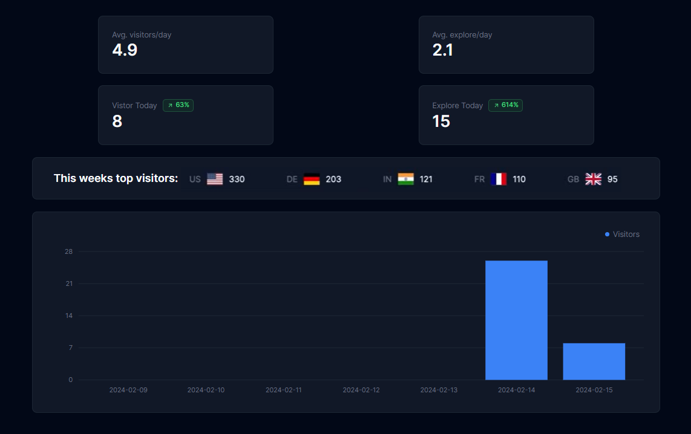

# 📊 Simple time series Next.js Analytics Dashboard

## 📝 Description:


</img> <br>

- Build a analytics system user tracking, time series dashboard (Home page, and contact page), which can be located in any admin page for User management. This is my second data plateform dashboard, the different is I am using Nextjs and typescripts.

## 🛠 Tech Stacks:

- Next.js
- Node v20.10.0
- Upstash Redis
- date-fns
- @tremor/react-charts (https://www.tremor.so/) for graphing
- react-country-flag
- lucide-react: icons library

## ♻ Structure:

- Model: responsible for fetching data from Redis, this is analytics provider.
- Controller: responsible for processing data, like ('pageviews', 2) in page.tsx
- View: responsible for rendering whatever the controller has processed, AnalyticsDashboard component.

## 📖 Learning Notes:

1. In this project, I understand metadata and namespace for making the data retrieval faster.

2. In `tsconfig.josn`, add "noUncheckedIndexedAccess": true, // noUncheckedIndexedAccess MEANS if you have an array of type string and you try to access an index that doesn't exist, it will throw an error
3. List countries visitors, by <u>**"target": "es2015"**</u> in tsconfig.json, I can use Map and Set in typescript.

```ts
//compare the countries and ordering them
const topCountries = [...topCountriesMap.entries()]
  .sort((a, b) => {
    if (a[1] > b[1]) {
      return -1;
    } else {
      return 1;
    }
  })
  .slice(0, 5); //top 5 countries
```

💌 Happy coding in Valentine's day, **history**: On February 14, 1946, the world's first general-purpose computer was born at the University of Pennsylvania in the United States. On this special day, please spend some extra time ⏳ with your computer.
